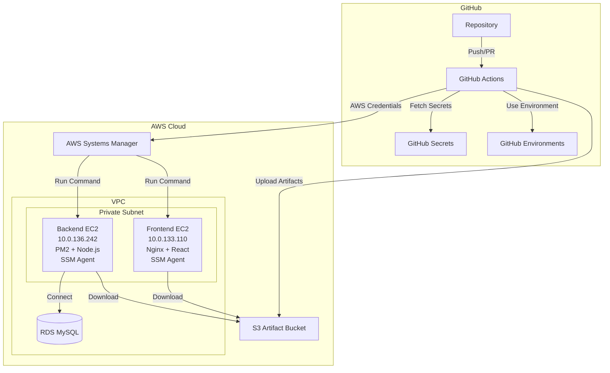

# Design Document: GitHub Actions CI/CD Pipeline

## Overview

This design document outlines the architecture and implementation details for a GitHub Actions CI/CD pipeline that deploys a 3-tier application (React frontend, Node.js backend) to EC2 instances in private subnets. The pipeline follows GitOps principles and implements security best practices including self-hosted runners, encrypted secrets, and automated rollback capabilities.

## Architecture



## CI/CD Stages Overview

### Stage 1: Continuous Integration (CI)
| Step | Frontend | Backend |
|------|----------|---------|
| 1.1 | Checkout code | Checkout code |
| 1.2 | Setup Node.js 18 | Setup Node.js 18 |
| 1.3 | Restore npm cache | Restore npm cache |
| 1.4 | Install dependencies (npm ci) | Install dependencies (npm ci) |
| 1.5 | Run ESLint | Run ESLint |
| 1.6 | Run unit tests | Run unit tests |
| 1.7 | Build production bundle | Validate .env config |
| 1.8 | Upload build artifact | - |

### Stage 2: Security Scanning
| Step | Description | Tool |
|------|-------------|------|
| 2.1 | Dependency vulnerability scan | npm audit / Snyk |
| 2.2 | Static Application Security Testing (SAST) | CodeQL / SonarCloud |
| 2.3 | Secret detection in code | Gitleaks / TruffleHog |
| 2.4 | License compliance check | license-checker |
| 2.5 | Container image scan (if applicable) | Trivy |

### Stage 3: Code Quality Gates
| Step | Description | Tool |
|------|-------------|------|
| 3.1 | Code coverage threshold (>80%) | Jest / NYC |
| 3.2 | Code complexity analysis | SonarCloud |
| 3.3 | Duplicate code detection | SonarCloud / jscpd |
| 3.4 | Branch protection enforcement | GitHub Branch Rules |
| 3.5 | PR review requirement | GitHub CODEOWNERS |

### Stage 4: Continuous Deployment (CD)
| Step | Frontend | Backend |
|------|----------|---------|
| 4.1 | Download build artifact from CI | Checkout code |
| 4.2 | Configure AWS credentials | Configure AWS credentials |
| 4.3 | Upload to S3 staging bucket | Upload to S3 staging bucket |
| 4.4 | SSM: Backup current deployment | SSM: Backup current deployment |
| 4.5 | SSM: Download from S3 | SSM: Download from S3 |
| 4.6 | SSM: Deploy to /var/www/html | SSM: Deploy to ~/app |
| 4.7 | SSM: Reload Nginx | SSM: npm ci --production |
| 4.8 | - | SSM: PM2 restart |

### Stage 5: Post-Deployment Verification
| Step | Description |
|------|-------------|
| 5.1 | Wait for service stabilization (10-15s) |
| 5.2 | Health check - verify HTTP 200 response |
| 5.3 | Smoke test - verify critical endpoints |
| 5.4 | Performance baseline check |
| 5.5 | On failure: Automatic rollback from backup |

### Stage 6: Monitoring & Observability
| Step | Description | Tool |
|------|-------------|------|
| 6.1 | Application Performance Monitoring | CloudWatch / Datadog |
| 6.2 | Error tracking and alerting | CloudWatch Alarms |
| 6.3 | Log aggregation | CloudWatch Logs |
| 6.4 | Deployment tracking | GitHub Deployments API |
| 6.5 | Notification dispatch | Slack / Email |

## Components and Interfaces

### 1. AWS Systems Manager (SSM) Integration

Since EC2 instances have SSM enabled, we use SSM Run Command instead of SSH for secure, auditable deployments without opening inbound ports.

**Benefits over SSH:**
- No SSH keys to manage
- No inbound ports required on EC2
- Full audit trail in CloudTrail
- IAM-based access control
- Works with private subnet instances without bastion

**Required IAM Permissions for GitHub Actions:**
```json
{
  "Version": "2012-10-17",
  "Statement": [
    {
      "Effect": "Allow",
      "Action": [
        "ssm:SendCommand",
        "ssm:GetCommandInvocation",
        "ssm:ListCommandInvocations"
      ],
      "Resource": "*"
    },
    {
      "Effect": "Allow",
      "Action": [
        "s3:PutObject",
        "s3:GetObject",
        "s3:DeleteObject"
      ],
      "Resource": "arn:aws:s3:::your-deployment-bucket/*"
    }
  ]
}
```

### 2. GitHub Secrets Structure

```
Repository Secrets:
├── AWS_ACCESS_KEY_ID        # IAM user access key
├── AWS_SECRET_ACCESS_KEY    # IAM user secret key
├── AWS_REGION               # e.g., us-east-1
├── FRONTEND_INSTANCE_ID     # i-xxxxxxxxxxxxxxxxx (frontend EC2)
├── BACKEND_INSTANCE_ID      # i-xxxxxxxxxxxxxxxxx (backend EC2)
├── S3_DEPLOYMENT_BUCKET     # Bucket for deployment artifacts
├── DB_HOST                  # RDS endpoint
├── DB_USERNAME              # Database username
├── DB_PASSWORD              # Database password
├── SLACK_WEBHOOK_URL        # (Optional) Notification webhook
└── API_BASE_URL             # Backend API URL for frontend config
```

### 3. Workflow File Structure

```
.github/
└── workflows/
    ├── ci.yml                    # CI pipeline (lint, test, build)
    ├── deploy-frontend.yml       # Frontend deployment via SSM
    ├── deploy-backend.yml        # Backend deployment via SSM
    └── rollback.yml              # Manual rollback workflow
```

### 4. CI Workflow Component

**File**: `.github/workflows/ci.yml`

```yaml
name: CI Pipeline

on:
  push:
    branches: [main, develop]
  pull_request:
    branches: [main]

concurrency:
  group: ci-${{ github.ref }}
  cancel-in-progress: true

jobs:
  frontend-ci:
    runs-on: ubuntu-latest
    defaults:
      run:
        working-directory: client
    
    steps:
      - uses: actions/checkout@v4
      
      - name: Setup Node.js
        uses: actions/setup-node@v4
        with:
          node-version: '18'
          cache: 'npm'
          cache-dependency-path: client/package-lock.json
      
      - name: Install dependencies
        run: npm ci
      
      - name: Run linting
        run: npm run lint --if-present
      
      - name: Run tests with coverage
        run: npm test -- --watchAll=false --passWithNoTests --coverage
      
      - name: Upload coverage report
        uses: codecov/codecov-action@v4
        with:
          directory: ./client/coverage
          fail_ci_if_error: false
      
      - name: Build application
        run: npm run build
        env:
          REACT_APP_API_URL: ${{ vars.API_BASE_URL }}
      
      - name: Upload build artifact
        uses: actions/upload-artifact@v4
        with:
          name: frontend-build
          path: client/build/
          retention-days: 7

  backend-ci:
    runs-on: ubuntu-latest
    defaults:
      run:
        working-directory: backend
    
    steps:
      - uses: actions/checkout@v4
      
      - name: Setup Node.js
        uses: actions/setup-node@v4
        with:
          node-version: '18'
          cache: 'npm'
          cache-dependency-path: backend/package-lock.json
      
      - name: Install dependencies
        run: npm ci
      
      - name: Run linting
        run: npm run lint --if-present
      
      - name: Validate environment config
        run: |
          if [ ! -f .env.example ]; then
            echo "Warning: .env.example not found"
          fi

  # Security Scanning Job
  security-scan:
    runs-on: ubuntu-latest
    needs: [frontend-ci, backend-ci]
    
    steps:
      - uses: actions/checkout@v4
      
      - name: Setup Node.js
        uses: actions/setup-node@v4
        with:
          node-version: '18'
      
      # Dependency Vulnerability Scanning
      - name: Run npm audit (Frontend)
        working-directory: client
        run: npm audit --audit-level=high || true
        continue-on-error: true
      
      - name: Run npm audit (Backend)
        working-directory: backend
        run: npm audit --audit-level=high || true
        continue-on-error: true
      
      # Secret Detection
      - name: Gitleaks Secret Scan
        uses: gitleaks/gitleaks-action@v2
        env:
          GITHUB_TOKEN: ${{ secrets.GITHUB_TOKEN }}
      
      # SAST with CodeQL
      - name: Initialize CodeQL
        uses: github/codeql-action/init@v3
        with:
          languages: javascript
      
      - name: Perform CodeQL Analysis
        uses: github/codeql-action/analyze@v3
      
      # License Compliance
      - name: Check licenses (Frontend)
        working-directory: client
        run: |
          npm install -g license-checker
          license-checker --onlyAllow 'MIT;Apache-2.0;BSD-2-Clause;BSD-3-Clause;ISC;CC0-1.0;Unlicense' || true
        continue-on-error: true
      
      - name: Check licenses (Backend)
        working-directory: backend
        run: |
          license-checker --onlyAllow 'MIT;Apache-2.0;BSD-2-Clause;BSD-3-Clause;ISC;CC0-1.0;Unlicense' || true
        continue-on-error: true

  # Code Quality Job
  code-quality:
    runs-on: ubuntu-latest
    needs: [frontend-ci, backend-ci]
    
    steps:
      - uses: actions/checkout@v4
        with:
          fetch-depth: 0  # Full history for SonarCloud
      
      - name: SonarCloud Scan
        uses: SonarSource/sonarcloud-github-action@master
        env:
          GITHUB_TOKEN: ${{ secrets.GITHUB_TOKEN }}
          SONAR_TOKEN: ${{ secrets.SONAR_TOKEN }}
        with:
          args: >
            -Dsonar.projectKey=${{ github.repository_owner }}_${{ github.event.repository.name }}
            -Dsonar.organization=${{ github.repository_owner }}
        continue-on-error: true
```

### 5. Frontend Deployment Component

**File**: `.github/workflows/deploy-frontend.yml`

```yaml
name: Deploy Frontend

on:
  workflow_run:
    workflows: ["CI Pipeline"]
    branches: [main]
    types: [completed]
  workflow_dispatch:

concurrency:
  group: deploy-frontend
  cancel-in-progress: false

env:
  AWS_REGION: ${{ secrets.AWS_REGION }}

jobs:
  deploy:
    runs-on: ubuntu-latest
    if: ${{ github.event.workflow_run.conclusion == 'success' || github.event_name == 'workflow_dispatch' }}
    environment: production
    
    steps:
      - name: Download build artifact
        uses: actions/download-artifact@v4
        with:
          name: frontend-build
          path: ./build
          run-id: ${{ github.event.workflow_run.id }}
          github-token: ${{ secrets.GITHUB_TOKEN }}
      
      - name: Configure AWS credentials
        uses: aws-actions/configure-aws-credentials@v4
        with:
          aws-access-key-id: ${{ secrets.AWS_ACCESS_KEY_ID }}
          aws-secret-access-key: ${{ secrets.AWS_SECRET_ACCESS_KEY }}
          aws-region: ${{ secrets.AWS_REGION }}
      
      - name: Upload build to S3
        run: |
          TIMESTAMP=$(date +%Y%m%d%H%M%S)
          aws s3 sync ./build s3://${{ secrets.S3_DEPLOYMENT_BUCKET }}/frontend/$TIMESTAMP/
          echo "DEPLOY_PATH=frontend/$TIMESTAMP" >> $GITHUB_ENV
      
      - name: Backup current deployment via SSM
        run: |
          COMMAND_ID=$(aws ssm send-command \
            --instance-ids ${{ secrets.FRONTEND_INSTANCE_ID }} \
            --document-name "AWS-RunShellScript" \
            --parameters 'commands=["sudo cp -r /var/www/html /var/www/html.backup.$(date +%Y%m%d%H%M%S) 2>/dev/null || true"]' \
            --query 'Command.CommandId' --output text)
          
          aws ssm wait command-executed \
            --command-id $COMMAND_ID \
            --instance-id ${{ secrets.FRONTEND_INSTANCE_ID }}
      
      - name: Deploy to frontend server via SSM
        run: |
          COMMAND_ID=$(aws ssm send-command \
            --instance-ids ${{ secrets.FRONTEND_INSTANCE_ID }} \
            --document-name "AWS-RunShellScript" \
            --parameters commands='[
              "aws s3 sync s3://${{ secrets.S3_DEPLOYMENT_BUCKET }}/${{ env.DEPLOY_PATH }}/ /tmp/frontend-build/",
              "sudo rm -rf /var/www/html/*",
              "sudo cp -r /tmp/frontend-build/* /var/www/html/",
              "sudo systemctl reload nginx || sudo systemctl reload apache2",
              "rm -rf /tmp/frontend-build"
            ]' \
            --query 'Command.CommandId' --output text)
          
          aws ssm wait command-executed \
            --command-id $COMMAND_ID \
            --instance-id ${{ secrets.FRONTEND_INSTANCE_ID }}
          
          # Check command status
          STATUS=$(aws ssm get-command-invocation \
            --command-id $COMMAND_ID \
            --instance-id ${{ secrets.FRONTEND_INSTANCE_ID }} \
            --query 'Status' --output text)
          
          if [ "$STATUS" != "Success" ]; then
            echo "::error::Deployment failed with status: $STATUS"
            exit 1
          fi
      
      - name: Health check via SSM
        run: |
          sleep 10
          COMMAND_ID=$(aws ssm send-command \
            --instance-ids ${{ secrets.FRONTEND_INSTANCE_ID }} \
            --document-name "AWS-RunShellScript" \
            --parameters 'commands=["curl -sf http://localhost/ || exit 1"]' \
            --query 'Command.CommandId' --output text)
          
          aws ssm wait command-executed \
            --command-id $COMMAND_ID \
            --instance-id ${{ secrets.FRONTEND_INSTANCE_ID }} || {
            echo "::error::Health check failed"
            exit 1
          }
      
      - name: Notify success
        if: success()
        run: |
          echo "✅ Frontend deployed successfully"
          echo "Commit: ${{ github.sha }}"
      
      - name: Rollback on failure
        if: failure()
        run: |
          COMMAND_ID=$(aws ssm send-command \
            --instance-ids ${{ secrets.FRONTEND_INSTANCE_ID }} \
            --document-name "AWS-RunShellScript" \
            --parameters 'commands=[
              "LATEST_BACKUP=$(ls -td /var/www/html.backup.* 2>/dev/null | head -1)",
              "if [ -n \"$LATEST_BACKUP\" ]; then sudo rm -rf /var/www/html/* && sudo cp -r $LATEST_BACKUP/* /var/www/html/ && sudo systemctl reload nginx; fi"
            ]' \
            --query 'Command.CommandId' --output text)
          
          aws ssm wait command-executed \
            --command-id $COMMAND_ID \
            --instance-id ${{ secrets.FRONTEND_INSTANCE_ID }}
          echo "⚠️ Rolled back to previous deployment"
```

### 6. Backend Deployment Component

**File**: `.github/workflows/deploy-backend.yml`

```yaml
name: Deploy Backend

on:
  workflow_run:
    workflows: ["CI Pipeline"]
    branches: [main]
    types: [completed]
  workflow_dispatch:

concurrency:
  group: deploy-backend
  cancel-in-progress: false

env:
  AWS_REGION: ${{ secrets.AWS_REGION }}

jobs:
  deploy:
    runs-on: ubuntu-latest
    if: ${{ github.event.workflow_run.conclusion == 'success' || github.event_name == 'workflow_dispatch' }}
    environment: production
    
    steps:
      - uses: actions/checkout@v4
      
      - name: Configure AWS credentials
        uses: aws-actions/configure-aws-credentials@v4
        with:
          aws-access-key-id: ${{ secrets.AWS_ACCESS_KEY_ID }}
          aws-secret-access-key: ${{ secrets.AWS_SECRET_ACCESS_KEY }}
          aws-region: ${{ secrets.AWS_REGION }}
      
      - name: Upload backend code to S3
        run: |
          TIMESTAMP=$(date +%Y%m%d%H%M%S)
          cd backend
          zip -r ../backend-$TIMESTAMP.zip . -x "node_modules/*" -x ".env"
          aws s3 cp ../backend-$TIMESTAMP.zip s3://${{ secrets.S3_DEPLOYMENT_BUCKET }}/backend/backend-$TIMESTAMP.zip
          echo "DEPLOY_FILE=backend/backend-$TIMESTAMP.zip" >> $GITHUB_ENV
          echo "TIMESTAMP=$TIMESTAMP" >> $GITHUB_ENV
      
      - name: Backup current deployment via SSM
        run: |
          COMMAND_ID=$(aws ssm send-command \
            --instance-ids ${{ secrets.BACKEND_INSTANCE_ID }} \
            --document-name "AWS-RunShellScript" \
            --parameters 'commands=["cp -r ~/app ~/app.backup.$(date +%Y%m%d%H%M%S) 2>/dev/null || true"]' \
            --query 'Command.CommandId' --output text)
          
          aws ssm wait command-executed \
            --command-id $COMMAND_ID \
            --instance-id ${{ secrets.BACKEND_INSTANCE_ID }}
      
      - name: Deploy backend code via SSM
        run: |
          COMMAND_ID=$(aws ssm send-command \
            --instance-ids ${{ secrets.BACKEND_INSTANCE_ID }} \
            --document-name "AWS-RunShellScript" \
            --parameters commands='[
              "aws s3 cp s3://${{ secrets.S3_DEPLOYMENT_BUCKET }}/${{ env.DEPLOY_FILE }} /tmp/backend.zip",
              "rm -rf ~/app.new && mkdir -p ~/app.new",
              "unzip -o /tmp/backend.zip -d ~/app.new",
              "cp ~/app/.env ~/app.new/.env 2>/dev/null || true",
              "cd ~/app.new && npm ci --production",
              "rm -rf ~/app.old && mv ~/app ~/app.old 2>/dev/null || true",
              "mv ~/app.new ~/app",
              "cd ~/app && pm2 restart backendAPI || pm2 start index.js --name backendAPI",
              "pm2 save",
              "rm -f /tmp/backend.zip"
            ]' \
            --query 'Command.CommandId' --output text)
          
          # Wait with timeout
          for i in {1..30}; do
            STATUS=$(aws ssm get-command-invocation \
              --command-id $COMMAND_ID \
              --instance-id ${{ secrets.BACKEND_INSTANCE_ID }} \
              --query 'Status' --output text 2>/dev/null || echo "Pending")
            
            if [ "$STATUS" = "Success" ]; then
              echo "Deployment completed successfully"
              break
            elif [ "$STATUS" = "Failed" ] || [ "$STATUS" = "Cancelled" ]; then
              echo "::error::Deployment failed with status: $STATUS"
              exit 1
            fi
            sleep 10
          done
      
      - name: Health check via SSM
        run: |
          sleep 15
          COMMAND_ID=$(aws ssm send-command \
            --instance-ids ${{ secrets.BACKEND_INSTANCE_ID }} \
            --document-name "AWS-RunShellScript" \
            --parameters 'commands=["curl -sf http://localhost:80/books || curl -sf http://localhost:3000/books || exit 1"]' \
            --query 'Command.CommandId' --output text)
          
          aws ssm wait command-executed \
            --command-id $COMMAND_ID \
            --instance-id ${{ secrets.BACKEND_INSTANCE_ID }} || {
            echo "::error::Health check failed"
            exit 1
          }
      
      - name: Notify success
        if: success()
        run: |
          echo "✅ Backend deployed successfully"
          echo "Commit: ${{ github.sha }}"
      
      - name: Rollback on failure
        if: failure()
        run: |
          COMMAND_ID=$(aws ssm send-command \
            --instance-ids ${{ secrets.BACKEND_INSTANCE_ID }} \
            --document-name "AWS-RunShellScript" \
            --parameters 'commands=[
              "LATEST_BACKUP=$(ls -td ~/app.backup.* 2>/dev/null | head -1)",
              "if [ -n \"$LATEST_BACKUP\" ]; then rm -rf ~/app && cp -r $LATEST_BACKUP ~/app && cd ~/app && npm ci --production && pm2 restart backendAPI; fi"
            ]' \
            --query 'Command.CommandId' --output text)
          
          aws ssm wait command-executed \
            --command-id $COMMAND_ID \
            --instance-id ${{ secrets.BACKEND_INSTANCE_ID }}
          echo "⚠️ Rolled back to previous deployment"
```

## Data Models

### Workflow Run State

```typescript
interface WorkflowRun {
  id: string;
  status: 'queued' | 'in_progress' | 'completed';
  conclusion: 'success' | 'failure' | 'cancelled' | null;
  commit_sha: string;
  branch: string;
  triggered_by: string;
  started_at: Date;
  completed_at: Date | null;
}

interface DeploymentRecord {
  id: string;
  environment: 'development' | 'staging' | 'production';
  target: 'frontend' | 'backend';
  commit_sha: string;
  status: 'pending' | 'success' | 'failure' | 'rolled_back';
  backup_path: string;
  deployed_at: Date;
}
```

### Environment Configuration

```typescript
interface EnvironmentConfig {
  name: string;
  protection_rules: {
    required_reviewers: number;
    wait_timer: number; // minutes
  };
  secrets: Record<string, string>;
  variables: Record<string, string>;
}
```

### 7. Monitoring and Notification Component

**CloudWatch Dashboard Setup (via SSM on EC2):**

```yaml
# Add to deployment workflow - Setup CloudWatch Agent
- name: Configure CloudWatch monitoring via SSM
  run: |
    COMMAND_ID=$(aws ssm send-command \
      --instance-ids ${{ secrets.BACKEND_INSTANCE_ID }} \
      --document-name "AWS-RunShellScript" \
      --parameters commands='[
        "# Install CloudWatch Agent if not present",
        "if ! command -v amazon-cloudwatch-agent-ctl &> /dev/null; then",
        "  sudo yum install -y amazon-cloudwatch-agent || sudo apt-get install -y amazon-cloudwatch-agent",
        "fi",
        "# Configure CloudWatch Agent for PM2 logs",
        "cat > /tmp/cloudwatch-config.json << EOF",
        "{",
        "  \"logs\": {",
        "    \"logs_collected\": {",
        "      \"files\": {",
        "        \"collect_list\": [",
        "          {",
        "            \"file_path\": \"/home/*/\\.pm2/logs/*-out.log\",",
        "            \"log_group_name\": \"/app/backend/stdout\",",
        "            \"log_stream_name\": \"{instance_id}\"",
        "          },",
        "          {",
        "            \"file_path\": \"/home/*/\\.pm2/logs/*-error.log\",",
        "            \"log_group_name\": \"/app/backend/stderr\",",
        "            \"log_stream_name\": \"{instance_id}\"",
        "          }",
        "        ]",
        "      }",
        "    }",
        "  },",
        "  \"metrics\": {",
        "    \"namespace\": \"App/Backend\",",
        "    \"metrics_collected\": {",
        "      \"cpu\": { \"measurement\": [\"cpu_usage_active\"] },",
        "      \"mem\": { \"measurement\": [\"mem_used_percent\"] },",
        "      \"disk\": { \"measurement\": [\"disk_used_percent\"] }",
        "    }",
        "  }",
        "}",
        "EOF",
        "sudo amazon-cloudwatch-agent-ctl -a fetch-config -m ec2 -c file:/tmp/cloudwatch-config.json -s"
      ]' \
      --query 'Command.CommandId' --output text)
```

**Slack Notification Integration:**

```yaml
# Add to deployment workflows
- name: Send Slack notification
  if: always()
  uses: slackapi/slack-github-action@v1.25.0
  with:
    payload: |
      {
        "blocks": [
          {
            "type": "header",
            "text": {
              "type": "plain_text",
              "text": "${{ job.status == 'success' && '✅ Deployment Successful' || '❌ Deployment Failed' }}"
            }
          },
          {
            "type": "section",
            "fields": [
              { "type": "mrkdwn", "text": "*Environment:*\nProduction" },
              { "type": "mrkdwn", "text": "*Target:*\n${{ github.workflow }}" },
              { "type": "mrkdwn", "text": "*Commit:*\n`${{ github.sha }}`" },
              { "type": "mrkdwn", "text": "*Branch:*\n${{ github.ref_name }}" },
              { "type": "mrkdwn", "text": "*Triggered by:*\n${{ github.actor }}" },
              { "type": "mrkdwn", "text": "*Status:*\n${{ job.status }}" }
            ]
          },
          {
            "type": "actions",
            "elements": [
              {
                "type": "button",
                "text": { "type": "plain_text", "text": "View Workflow" },
                "url": "${{ github.server_url }}/${{ github.repository }}/actions/runs/${{ github.run_id }}"
              }
            ]
          }
        ]
      }
  env:
    SLACK_WEBHOOK_URL: ${{ secrets.SLACK_WEBHOOK_URL }}
    SLACK_WEBHOOK_TYPE: INCOMING_WEBHOOK
```

**CloudWatch Alarms (Terraform/CloudFormation):**

```yaml
# cloudwatch-alarms.yml - Deploy via AWS CLI or IaC
Resources:
  BackendHighCPUAlarm:
    Type: AWS::CloudWatch::Alarm
    Properties:
      AlarmName: Backend-HighCPU
      MetricName: CPUUtilization
      Namespace: AWS/EC2
      Statistic: Average
      Period: 300
      EvaluationPeriods: 2
      Threshold: 80
      ComparisonOperator: GreaterThanThreshold
      Dimensions:
        - Name: InstanceId
          Value: !Ref BackendInstanceId
      AlarmActions:
        - !Ref SNSAlertTopic

  BackendHealthCheckAlarm:
    Type: AWS::CloudWatch::Alarm
    Properties:
      AlarmName: Backend-HealthCheck-Failed
      MetricName: HealthCheckStatus
      Namespace: App/Backend
      Statistic: Minimum
      Period: 60
      EvaluationPeriods: 3
      Threshold: 1
      ComparisonOperator: LessThanThreshold
      AlarmActions:
        - !Ref SNSAlertTopic

  FrontendHighCPUAlarm:
    Type: AWS::CloudWatch::Alarm
    Properties:
      AlarmName: Frontend-HighCPU
      MetricName: CPUUtilization
      Namespace: AWS/EC2
      Statistic: Average
      Period: 300
      EvaluationPeriods: 2
      Threshold: 80
      ComparisonOperator: GreaterThanThreshold
      Dimensions:
        - Name: InstanceId
          Value: !Ref FrontendInstanceId
      AlarmActions:
        - !Ref SNSAlertTopic
```

### 8. GitHub Branch Protection Rules

```json
// Repository Settings > Branches > Branch protection rules
{
  "branch": "main",
  "required_status_checks": {
    "strict": true,
    "contexts": [
      "frontend-ci",
      "backend-ci",
      "security-scan",
      "code-quality"
    ]
  },
  "enforce_admins": true,
  "required_pull_request_reviews": {
    "required_approving_review_count": 1,
    "dismiss_stale_reviews": true,
    "require_code_owner_reviews": true
  },
  "restrictions": null,
  "allow_force_pushes": false,
  "allow_deletions": false
}
```

### 9. CODEOWNERS File

**File**: `.github/CODEOWNERS`

```
# Default owners for everything
* @your-team

# Frontend specific
/client/ @frontend-team

# Backend specific  
/backend/ @backend-team

# Infrastructure and CI/CD
/.github/ @devops-team
```


## Correctness Properties

*A property is a characteristic or behavior that should hold true across all valid executions of a system—essentially, a formal statement about what the system should do. Properties serve as the bridge between human-readable specifications and machine-verifiable correctness guarantees.*

### Property 1: Secret Masking in Logs

*For any* secret value used in a GitHub Actions workflow, the workflow logs SHALL never contain the plaintext value of that secret.

**Validates: Requirements 2.2**

### Property 2: Secret Validation Before Use

*For any* workflow step that requires a secret, if the secret is not defined in GitHub Secrets, the workflow SHALL fail with a descriptive error before attempting to use the undefined secret value.

**Validates: Requirements 2.4, 2.5**

### Property 3: Reproducible Builds with npm ci

*For any* two workflow runs with identical package-lock.json content, the installed node_modules SHALL be byte-for-byte identical (excluding timestamps).

**Validates: Requirements 3.2, 4.2**

### Property 4: CI Failure Propagation

*For any* CI workflow where a step fails, all subsequent steps (except those marked `if: always()`) SHALL be skipped, and the workflow SHALL report a failure status.

**Validates: Requirements 3.7, 4.6**

### Property 5: Pre-Deployment Backup

*For any* deployment to frontend or backend EC2 instances, a backup of the current deployment SHALL exist before any files are modified or replaced.

**Validates: Requirements 5.4, 6.3**

### Property 6: Automatic Rollback on Failure

*For any* deployment that fails (including health check failures), if a backup exists, the system SHALL restore the previous deployment from the backup.

**Validates: Requirements 5.8, 6.8, 9.4**

### Property 7: Deployment Concurrency Control

*For any* two deployment workflows triggered for the same target (frontend or backend), only one SHALL execute at a time; the second SHALL either queue or be cancelled based on concurrency settings.

**Validates: Requirements 7.5**

### Property 8: Notification Metadata Completeness

*For any* deployment notification (success or failure), the notification content SHALL include: commit SHA, branch name, and the identity of the user/event that triggered the deployment.

**Validates: Requirements 8.3**

### Property 9: Cache Key Determinism

*For any* change to package-lock.json, the npm cache key SHALL change, ensuring fresh dependencies are installed when the lock file is modified.

**Validates: Requirements 10.2**

### Property 10: Environment Variable Isolation

*For any* deployment to a specific environment (development, staging, production), only the secrets and variables defined for that environment SHALL be injected into the build and deployment process.

**Validates: Requirements 11.4**

## Error Handling

### SSH Connection Failures

```yaml
- name: Setup SSH with retry
  run: |
    MAX_RETRIES=3
    RETRY_COUNT=0
    until ssh-keyscan -H ${{ secrets.HOST }} >> ~/.ssh/known_hosts 2>/dev/null; do
      RETRY_COUNT=$((RETRY_COUNT + 1))
      if [ $RETRY_COUNT -ge $MAX_RETRIES ]; then
        echo "::error::Failed to connect to host after $MAX_RETRIES attempts"
        exit 1
      fi
      echo "Retry $RETRY_COUNT of $MAX_RETRIES..."
      sleep 5
    done
```

### Missing Secrets Validation

```yaml
- name: Validate required secrets
  run: |
    MISSING_SECRETS=""
    [ -z "${{ secrets.SSH_PRIVATE_KEY }}" ] && MISSING_SECRETS="$MISSING_SECRETS SSH_PRIVATE_KEY"
    [ -z "${{ secrets.FRONTEND_HOST }}" ] && MISSING_SECRETS="$MISSING_SECRETS FRONTEND_HOST"
    [ -z "${{ secrets.EC2_USER }}" ] && MISSING_SECRETS="$MISSING_SECRETS EC2_USER"
    
    if [ -n "$MISSING_SECRETS" ]; then
      echo "::error::Missing required secrets:$MISSING_SECRETS"
      exit 1
    fi
```

### Deployment Failure Recovery

```yaml
- name: Rollback on failure
  if: failure()
  run: |
    echo "::warning::Deployment failed, initiating rollback..."
    LATEST_BACKUP=$(ssh -i ~/.ssh/deploy_key $USER@$HOST "ls -td ~/app.backup.* 2>/dev/null | head -1")
    
    if [ -z "$LATEST_BACKUP" ]; then
      echo "::error::No backup found for rollback"
      exit 1
    fi
    
    ssh -i ~/.ssh/deploy_key $USER@$HOST "rm -rf ~/app && cp -r $LATEST_BACKUP ~/app"
    echo "::notice::Rolled back to $LATEST_BACKUP"
```

### Health Check Failures

```yaml
- name: Health check with timeout
  run: |
    MAX_WAIT=60
    INTERVAL=5
    ELAPSED=0
    
    while [ $ELAPSED -lt $MAX_WAIT ]; do
      if curl -sf http://localhost:$PORT/health > /dev/null 2>&1; then
        echo "::notice::Health check passed"
        exit 0
      fi
      sleep $INTERVAL
      ELAPSED=$((ELAPSED + INTERVAL))
    done
    
    echo "::error::Health check failed after ${MAX_WAIT}s"
    exit 1
```

## Testing Strategy

### Unit Tests

Unit tests verify specific workflow configurations and scripts:

1. **Workflow Syntax Validation**: Use `actionlint` to validate YAML syntax
2. **Script Testing**: Test deployment scripts locally with mock environments
3. **Configuration Validation**: Verify required fields in workflow files

```bash
# Install actionlint
brew install actionlint

# Validate all workflow files
actionlint .github/workflows/*.yml
```

### Integration Tests

Integration tests verify end-to-end workflow behavior:

1. **Dry Run Deployments**: Test deployment scripts against staging environment
2. **Rollback Testing**: Verify rollback procedures work correctly
3. **Health Check Testing**: Verify health endpoints respond correctly

### Property-Based Tests

Property-based tests validate universal properties across many inputs:

1. **Secret Masking Test**: Generate random secret values and verify they don't appear in logs
2. **Cache Key Test**: Modify package-lock.json and verify cache key changes
3. **Concurrency Test**: Trigger multiple deployments and verify serialization

### Test Configuration

- **Framework**: GitHub Actions workflow testing with `act` for local testing
- **Minimum iterations**: 100 for property-based tests
- **Tag format**: `Feature: github-actions-cicd, Property {number}: {property_text}`

### Manual Testing Checklist

- [ ] Verify self-hosted runner connects to GitHub
- [ ] Verify runner can SSH to frontend EC2
- [ ] Verify runner can SSH to backend EC2
- [ ] Trigger CI on pull request
- [ ] Verify CI blocks merge on failure
- [ ] Trigger deployment on main merge
- [ ] Verify backup is created before deployment
- [ ] Verify health check runs after deployment
- [ ] Simulate deployment failure and verify rollback
- [ ] Verify notifications are sent
